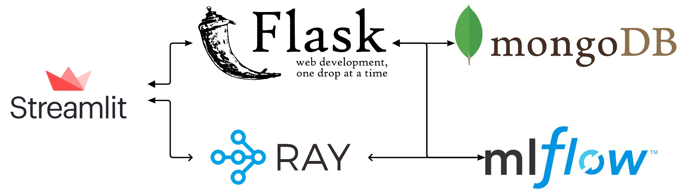
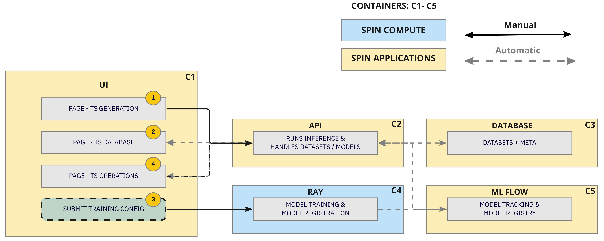
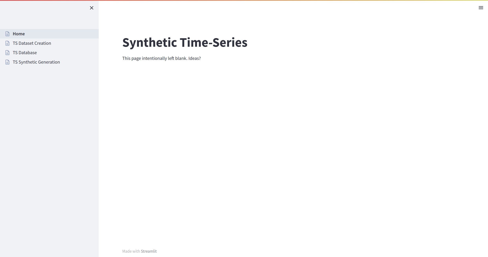
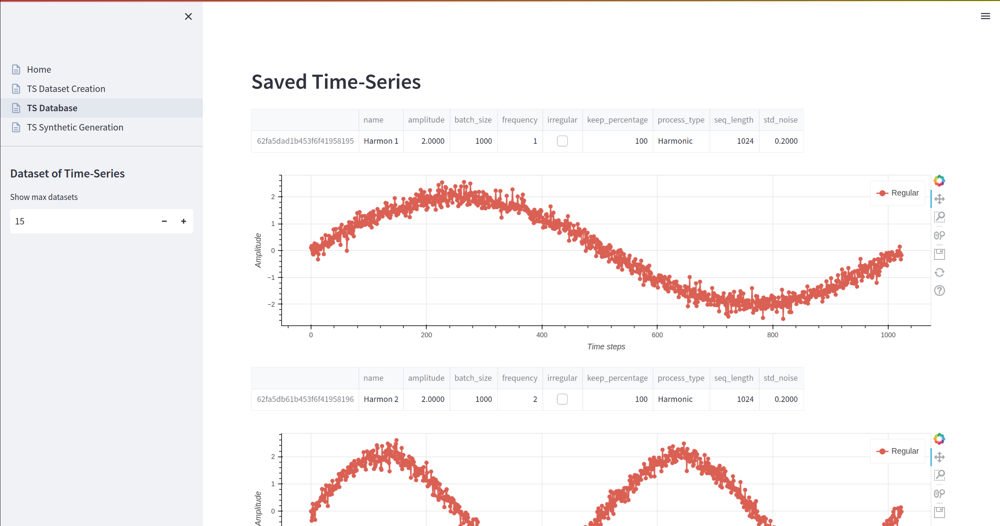
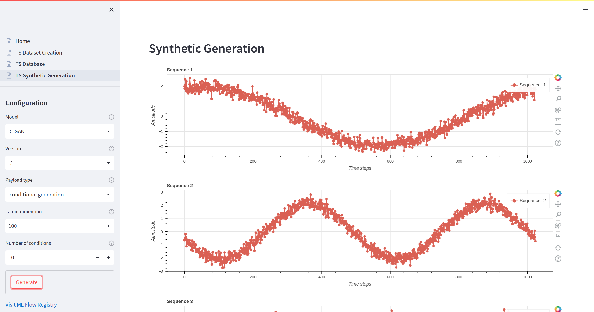
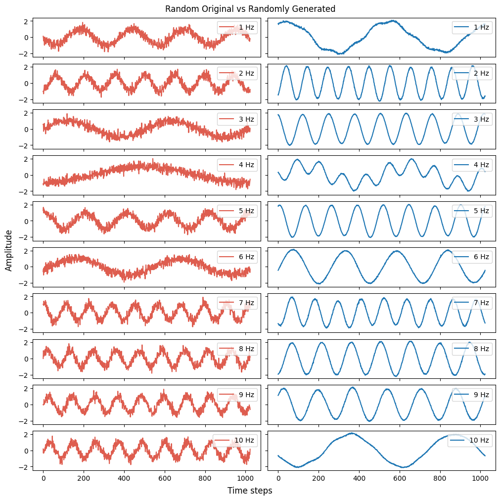
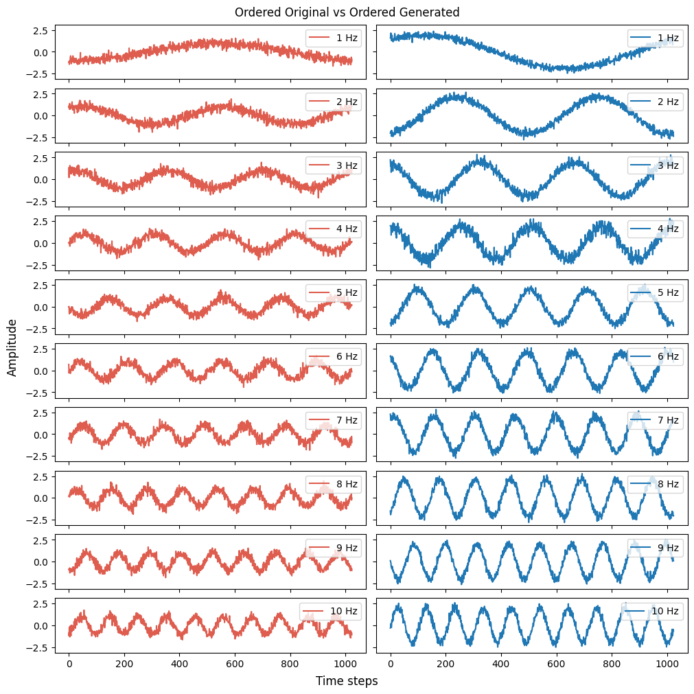

<h1 align="center">Synthetic Time-Series</h1>

Generate synthetic time-series using generative adversarial networks. This project holds an end-to-end system for generating time-series dataset with database support, training scripts running on compute clusters, post-training model registration, interactive model inferences with time-series visualization.

</br>
</br>

<h2 align="center">Software Architecture</h2>
<p align="center"></p>

</br>
<h2 align="center">Docker Structure</h2>
<p align="center"></p>

</br>

### How It Works
1. Create dataset in the TS Generation page. Dataset is sent to API which saves it in the Mongo DB database with the configurations parameters used.
2. From the TS Database page, we query the API and get automatically all the datasets available from the database. We can then inspect/interact with the vizualized datasets (time-series).
3. We're now ready to initiate a training session by submitting a train job to the Ray. In addition to training functions, we're required to set a model name and the dataset name we want.
From the training script, we submit the job to Ray, which runs the job, saves each model after each training and finally loops through all of the trials,
and registrates the best one to the database. As the job is running we can inspect the progression for each trial in the ML Flow.
4. As the page loads, we fetch all registrated models from the model registry. By selecting the model we want, we can send a inference request to the API with a given model name, version and inference parameters. The request will prompt the API to load the registrated model from the ML Flow model registry (or use a locally cached version).
Subsequently, the API runs a forward pass on the data provided, and returns a prediction response. Finally, the UI application will process the meta response and render a interactive vizualization of the prediction.


</br>

## User-Interface

<h2 align="center">HOME</h2>
<p align="center"></p>

</br>

<h2 align="center">TS Generation</h2>
<p align="center"></p>


</br>

<h2 align="center">TS Database</h2>
<p align="center"></p>


</br>

<h2 align="center">TS Operations</h2>
<p align="center"></p>


## File structure
```bash
.
├── docker-compose.yml
├── Dockerfile
├── pyproject.toml
├── README.md
├── setup.py
└── synthetic_data
    ├── api
    │   └── *.py
    ├── app
    │   ├── *.py
    │   └── pages
    │       └── *.py
    ├── common
    │   ├── *.py
    └── mlops
        ├── datasets
        │   └── *.py
        ├── models
        │   └── *.py
        ├── tools
        │   └── *.py
        ├── train_*.py
        ├── train_*.sh
        └── transforms
            └── *.py
```

## Prerequisites
- Service running [Ray ML](https://ray.readthedocs.io/en/latest/)
- Service running [ML Flow](https://www.mlflow.org/)

## Usage
1. Follow [instructions](https://docs.docker.com/engine/install/) for installing Docker Engine.
   
2. Install repository 

    ```bash
    git clone git@github.com:ML4ITS/synthetic-data.git
    cd synthetic-data
    ```


3. Create an environment file (.env) with the following credentials:
   
    ```bash
    # Hostname of service/server running Ray ML (aka. the Ray compute cluster) 
    COMPUTATION_HOST=<REPLACE> // Service running Ray ML
    # Port of service/server running Ray ML (aka. the Ray compute cluster) 
    RAY_PORT=<REPLACE>

    # Hostname of service/server running ML Flow 
    APPLICATION_HOST=<REPLACE>
    # Port of service/server running ML Flow 
    MODELREG_PORT=<REPLACE>

    # Select the name of your database
    DATABASE_NAME=<REPLACE>
    
    # Protect the database with your username & password
    DATABASE_USERNAME=<REPLACE>
    DATABASE_PASSWORD=<REPLACE>

    # Hostname of database (aka. the name of the container when running Docker)
    DATABASE_HOST=mongodb
    DATABASE_PORT=27017

    # Hostname of service/server running the API (aka. the name of the container when running Docker)
    BACKEND_HOST=backend
    BACKEND_PORT=8502
    ```

    *The following credentials are then stored in the .env file, and will be located
    by [dotenv](https://github.com/theskumar/python-dotenv) to handle the various config classes when running the application. \
    When interfacing with Ray Tune / ML Flow, we use underlying server configuration:*
    ```python
      class ServerConfig:

          @property
          def APPLICATION_HOST(self):
              return os.getenv("APPLICATION_HOST")

          @property
          def COMPUTATION_HOST(self):
              return os.getenv("COMPUTATION_HOST")
    ```
    (see [config.py](synthetic_data/common/config.py) for more details)

4. Run the following command to start the application:
   
    ```bash
      docker-compose up --build -d
    ```

### Training
1. Create an virtual environment and install dependencies

    *NOTE: local developement requires python 3.7, because of the timesynth library*
    ```bash
      virtualenv venv -p=python3.7
      source venv/bin/activate
      pip install -e .
    ```

2. Run the following shell script to train your C-GAN/WGAN-GP model:   
   
    *NOTE: adjust training parameters as needed inside their respective \*.py files*
   
    ```bash
      sh synthetic_data/mlops/train_cgan.sh
      # or
      sh synthetic_data/mlops/train_gan_gp.sh
    ```


## Evaluation
Following performance indications and visualizations are based on two models: the WGAN-GP model and the C-GAN model.
Both were trained on the same datasets. WGAN-GP model was trained using a learning rate of 0.0002, batch size of 128 and a total of 1000 epochs (or 9990050 global steps). C-GAN model was trained using a learning rate of 0.0002, batch size of 128 and a total of 300 epochs (or 3000050 global steps).

#### ---

Opposed to deep learning such as object detectors, GANs doesn't relly have a direct way of measuring performance so straight forward. Where object detectors could rely on intersection over union as simple and easy evaluation metric for measuring bounding boxes, GAN models are more difficult to guide and interpret in terms of training and performance.

Commonly, GAN models are used for image generation which is a task that is not directly related to time-series generation. For image generation, popular evaluation metrics such as Inception Score and Fréchet Inception Distance has been used to evaluate the performance of GAN models. Both of these metrics relies on a pre-trained Inception -model (developed for 2D -domain). This leaves us with the challenge of evaluating the performance of GAN models in terms of time-series generation, as we're working with 1D -domain.

#### ---
Efforts has been made to evaluate the performance of GAN models in terms of time-series generation. The [analysis.ipynb](https://github.com/ML4ITS/synthetic-data/blob/main/synthetic_data/mlops/analysis.ipynb) notebooks shows various experiments and results. By looking at a few of them, we can evaluate them visually.

The most straight forward way to evaluate the performance visually is to generate (e.g. 10 samples) and compare them equally to the real time-series data.

<h2 align="center">WGAN-GP: Randomly sampled original data vs. Random generated data</h2>
<p align="center"></p>

<h2 align="center">C-GAN: Sequentially sampled original data vs. Conditionally generated data</h2>
<p align="center"></p>

## t-SNE and PCA
T-SNE and PCA are two slightly more uncommon ways of evaluating performance, but they could help discovery insights by displaying clusters visually. For instance, using PCA, we sample the original and generated data from purely using the 10 Hz condition.

<h2 align="center">C-GAN: Condition on 10 Hz</h2>
<p align="center"></p>
--

## Latent-space exploration
To investigate how the models generalize as they are presented various latent-space inputs, we can by interpolation, manipulate the inputs to discover different but similar sequence generations. The examples below shows output sequences based on a given latent space from 10 different noise distributions with 200 spherical linear interpolation interpolations between each one. For setup and how to perform these interpolations, see the [slerp.ipynb](https://github.com/ML4ITS/synthetic-data/blob/main/synthetic_data/mlops/slerp.ipynb) notebook.

Both models were trained on the same multi-harmonic dataset, consisting of 10 000 time series evenly distributed between 1-10 Hz. Using conditions/labels, we can manipulate (embed) the input latent space to make the generator output desired frequencies. 

<h2 align="center">WGAN-GP: latent space interpolation (slerp)</h2>
<p align="center"></p>

</br>

<h2 align="center">C-GAN: latent space interpolation (slerp)</h2>
<p align="center"></p>

## Future suggestions
- Create unified 'model-registration-method' for training scripts
- Migrate model trainers to PyTorch Lightning
- Refactor LSMT to train with the new MultiHarmonicDataset
- Experiment with different types of generated time-series (e.g. gaussian process, pseudo-periodic, auto-regressive, etc.)
- Experiment with other datasets (e.g. synthetic, real, etc.)
- Refactor certain components of the application, and remove unnecessary/unused methods.
- Experiment with other evaluation metrics for GANs.
- Experiment with training / evaluating models using TSTR or TRTS.


