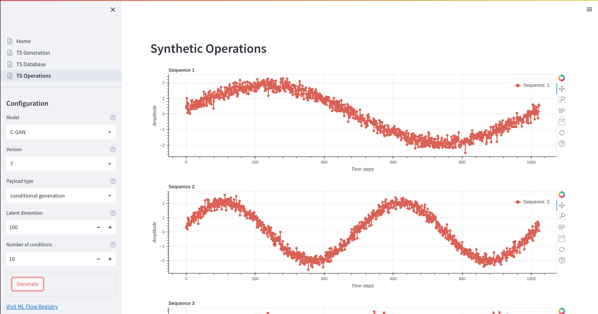

# Synthetic Time-Series
Generate synthetic time-series using generative adversarial networks. This project holds an end-to-end system for generating time-series dataset with database support, training scripts running on compute clusters, post-training model registration, interactive model inferences with time-series visualization.

</br>
</br>

## Architecture
<h2 align="center">Overview</h2>
<p align="center"></p>

### How It Works
1. Create dataset in the TS Generation page. Dataset is sent to API which saves it in the Mongo DB database with the configurations parameters used.
2. From the TS Database page, we query the API and get automatically all the datasets available from the database. We can then inspect/interact with the vizualized datasets (time-series).
3. We're now ready to initiate a training session by submitting a train job to the Ray. In addition to training functions, we're required to set a model name and the dataset name we want.
From the training script, we submit the job to Ray, which runs the job, saves each model after each training and finally loops through all of the trials,
and registrates the best one to the database. As the job is running we can inspect the progression for each trial in the ML Flow.
4. As the page loads, we fetch all registrated models from the model registry. By selecting the model we want, we can send a inference request to the API with a given model name, version and inference parameters. The request will prompt the API to load the registrated model from the ML Flow model registry (or use a locally cached version).
Subsequently, the API runs a forward pass on the data provided, and returns a prediction response. Finally, the UI application will process the meta response and render a interactive vizualization of the prediction.


</br>

## User-Interface

<h2 align="center">HOME</h2>
<p align="center"></p>

</br>

<h2 align="center">TS Generation</h2>
<p align="center"></p>


</br>

<h2 align="center">TS Database</h2>
<p align="center"></p>


</br>

<h2 align="center">TS Operations</h2>
<p align="center"></p>


## File structure
```bash
...
└── synthetic_data
    ├── api
    ├── app
    │   └── pages
    ├── common
    └── mlops
        ├── datasets
        ├── models
        ├── tools
        └── transforms
```

## Prerequisites
- Service running [Ray ML](https://ray.readthedocs.io/en/latest/)
- Service running [ML Flow](https://www.mlflow.org/)

## Usage
1. Follow [instructions](https://docs.docker.com/engine/install/) for installing Docker Engine.
   
2. Install repository 

    ```bash
    git clone git@github.com:ML4ITS/synthetic-data.git
    cd synthetic-data
    ```


3. Create an environment file (.env) with the following credentials:
   
    ```bash
    # Hostname of service/server running Ray ML (aka. the Ray compute cluster) 
    COMPUTATION_HOST=<REPLACE> // Service running Ray ML
    # Port of service/server running Ray ML (aka. the Ray compute cluster) 
    RAY_PORT=<REPLACE>

    # Hostname of service/server running ML Flow 
    APPLICATION_HOST=<REPLACE>
    # Port of service/server running ML Flow 
    MODELREG_PORT=<REPLACE>

    # Select the name of your database
    DATABASE_NAME=<REPLACE>
    
    # Protect the database with your username & password
    DATABASE_USERNAME=<REPLACE>
    DATABASE_PASSWORD=<REPLACE>

    # Hostname of database (aka. the name of the container when running Docker)
    DATABASE_HOST=mongodb
    DATABASE_PORT=27017

    # Hostname of service/server running the API (aka. the name of the container when running Docker)
    BACKEND_HOST=backend
    BACKEND_PORT=8502
    ```

    *The following credentials are then stored in the .env file, and will be located
    by [dotenv](https://github.com/theskumar/python-dotenv) to handle the various config classes when running the application. \
    When interfacing with Ray Tune / ML Flow, we use underlying server configuration:*
    ```python
      class ServerConfig:

          @property
          def APPLICATION_HOST(self):
              return os.getenv("APPLICATION_HOST")

          @property
          def COMPUTATION_HOST(self):
              return os.getenv("COMPUTATION_HOST")
    ```
    (see [config.py](synthetic_data/common/config.py) for more details)

4. Run the following command to start the application:
   
    ```bash
      docker-compose up --build -d
    ```

### Training
1. Create an virtual environment and install dependencies

    *NOTE: local developement requires python 3.7, because of the timesynth library*
    ```bash
      virtualenv venv -p=python3.7
      source venv/bin/activate
      pip install -e .
    ```

2. Run the following shell script to train your C-GAN/WGAN-GP model:   
   
    *NOTE: adjust training parameters as needed inside their respective \*.py files*
   
    ```bash
      sh synthetic_data/mlops/train_cgan.sh
      # or
      sh synthetic_data/mlops/train_gan_gp.sh
    ```


## Evaluation

### TODO
- [ ] Add evaluation metrics for the synthetic time-series dataset.
- [ ] Add evaluation metrics for the synthetic time-series dataset.
- [ ] Add visualization of the latent space interpolation for both models.


<h2 align="center">WGAN-GP: latent space interpolation (c5, t200)</h2>
<p align="center"></p>


## Future suggestions
- Create unified 'model-registration-method' for training scripts
- Migrate script trainer to PyTorch Lightning
- Add support for other datasets (e.g. stock prices, etc.)
- Experiment with different types of generated time-series (e.g. gaussian process, pseudo-periodic, auto-regressive, etc.)
- Refactor certain components of the application, and remove unnecessary/unused methods.
- Experiment with other evaluation metrics for GANs.
- Train and evaluate models using TSTR or TRTS.
